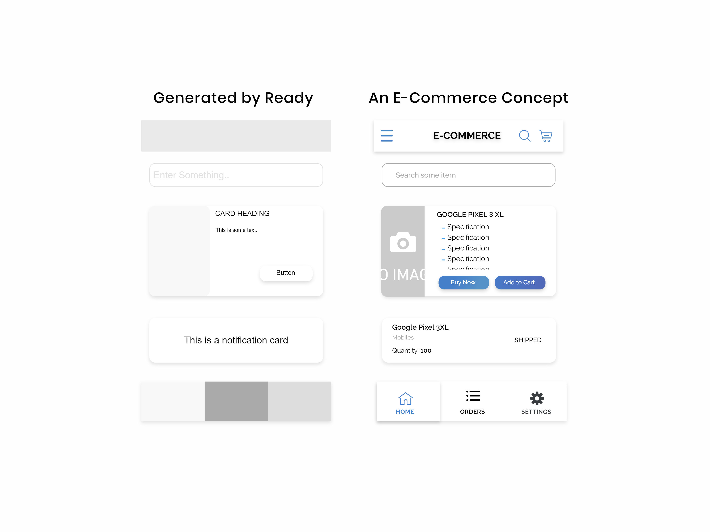

# Ready Components

An XD Plugin for ready made mobile components.

## Description:

The plugin provides ready made components which are generalized and can be used in any of the UI Design. The example given shows how the 'Ready' generated components can be used just by changing the color and other properties of the components.

## What is currently provided?
 - Card Component
 - List Card Component
 - Header Component
 - Footer Component
 - Textfield Component
 - Button
 - Toggle Button

#### Coming Soon! 
 - Popup and many more.
 
## How to install?
Ready Components is available on the XD Plugin store. Just open plugin manager and search for 'Ready Components' .You can also download it [here](https://github.com/rohit-rmethwani/ready-components/blob/master/installer/ready-components.xdx)! 
 
## How To use?
Open the Canvas:
 1. Select ` menu option ` in the upper right corner of your screen.
 2. Navigate to ` Plugins ` option.
 3. You can see ` Ready Components `. Select which component you want.
 4. The component is ready on your screen.
 5. Or else see the shortcuts for easy usage.

 COMPONENT | WINDOWS SHORTCUT | MAC OS SHORTCUT |
 |---|---|---|
 | Image Card Component | Shift+Ctrl+Alt+C | Cmd+Shift+Alt+C |
 | Notification/List Card Component | Shift+Ctrl+Alt+L | Cmd+Shift+Alt+L |
 | Header Component | Shift+Ctrl+Alt+H | Cmd+Shift+Alt+H |
 | Footer Component | Shift+Ctrl+Alt+D | Cmd+Shift+Alt+D |
 | Textfield Component | Shift+Ctrl+Alt+F | Cmd+Shift+Alt+F |
 | Button | Shift+Ctrl+Alt+B | Cmd+Shift+Alt+B |
 | Toggle Button | Shift+Ctrl+Alt+R | Cmd+Shift+Alt+R |
 | Accordion | Shift+Ctrl+Alt+X | Cmd+Shift+Alt+X |
 | Icon Box | Shift+Ctrl+Alt+Z | Cmd+Shfit+Alt+Z |
 | Basic Form | Shfit+Ctrl+Alt+A | Cmd+Shift+Alt+A | 
 | Sidebar | Shfit+Ctrl+Alt+S | Cmd+Shift+Alt+S |

## Drawbacks
The components are not placed at your desired place when you trigger the shortcut or select from menu. You have to drag the component to your desired place.

## Contribute to Ready!
You can contribute easily to ready. Refer [link](CONTRIBUTE.md).

## Contact
If you have any suggesstions, problems with the plugin please feel free to contact at `rohit.methwani31@gmail.com`.

## Example
 
